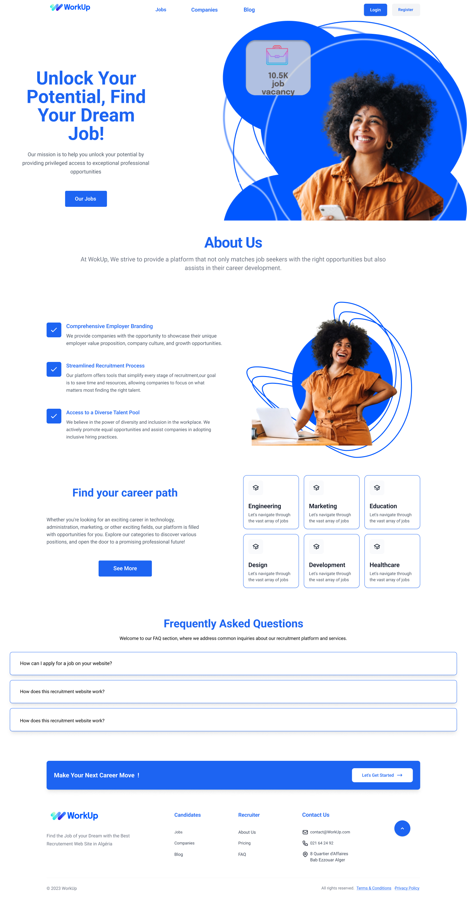

# Recruitment Website WorkUp

Welcome to my Recruitment Website repository! This website is designed to facilitate the recruitment process by providing a platform for job seekers and employers to connect and interact.

## Features

- Job seekers can create profiles, upload resumes, and search for job opportunities.
- Employers can create accounts, post job openings, and review candidate applications.
- Interactive dashboard for both job seekers and employers to manage their profiles, applications, and job postings.
- Advanced search functionality to help job seekers find relevant job listings.
- Responsive and user-friendly design for a seamless experience across different devices.

## Technologies Used

- Front-end: HTML, CSS, JavaScript, React
- Back-end: Node.js, Express.js
- Database: MongoDB
- Authentication: JSON Web Tokens (JWT)
- Real-time updates: Socket.IO

## Setup

To run this project locally, follow these steps:

1. Clone the repository:
2. Install the dependencies:
   cd WorkUp
   npm install
3. Set up the environment variables:
   Create a .env file in the root directory.
   Add the following variables:
   PORT=3000
   MONGODB_URI=<your-mongodb-uri>
   JWT_SECRET=<your-jwt-secret>

4. Start the development server:
   npm start
